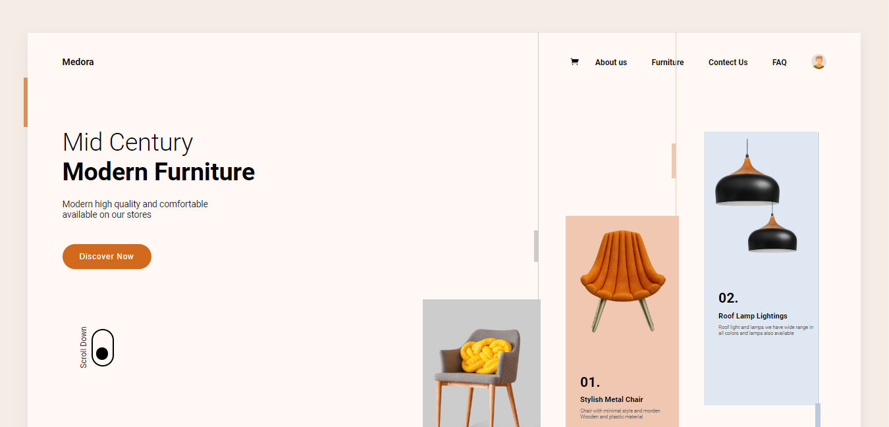
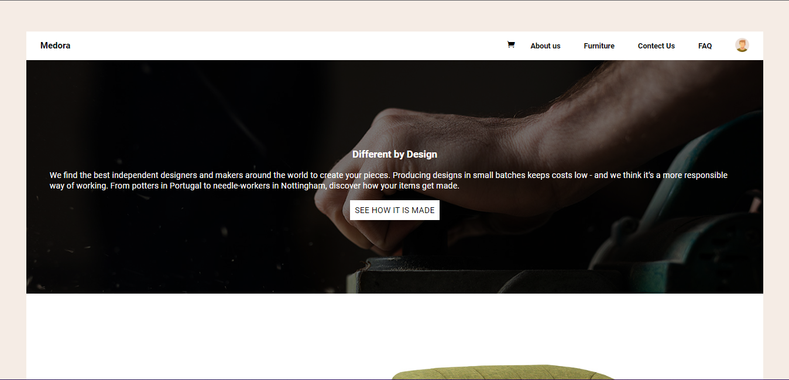
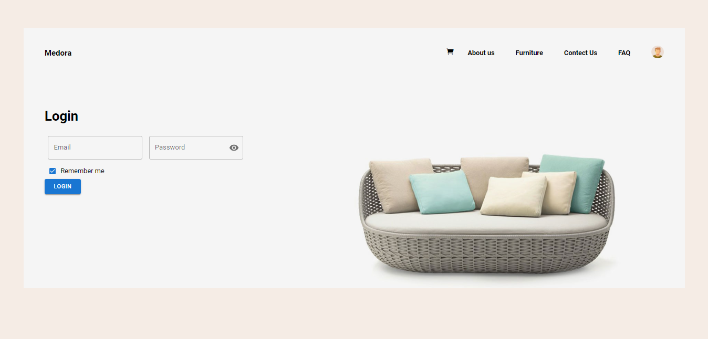
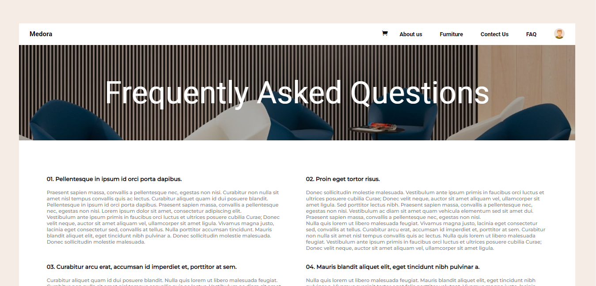
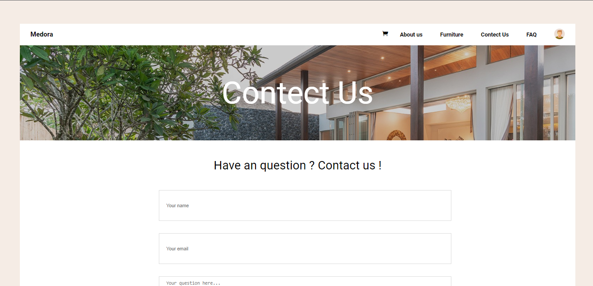
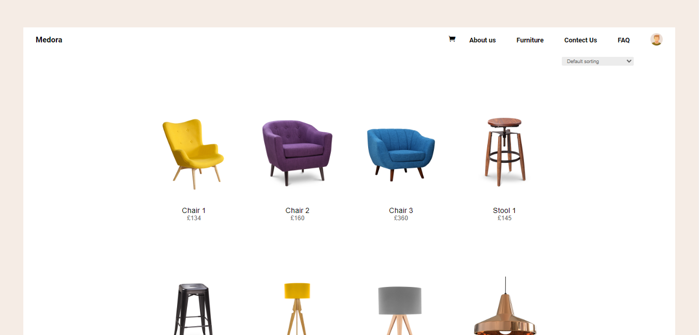
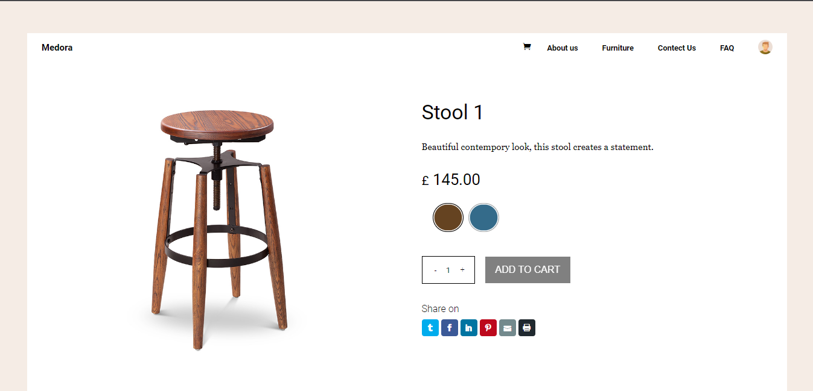
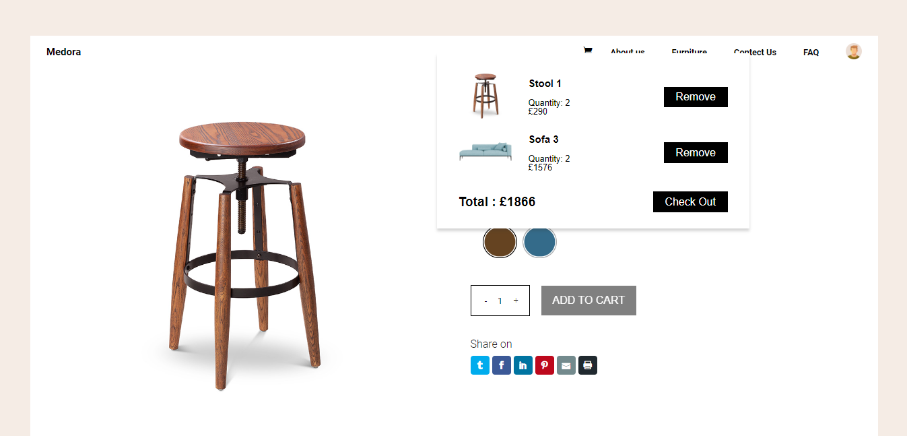

# Medura

Medura is a e-commerce furniture distributor company. Here you will find all type of furnitures and some additional products as well.
This is one my side projects. In this project I tried to build erverything with some animation and I am happy with it. I think I 
learned alot from it. In the future I like to try more different things in my project and explore more.

here is the link to checkout the site - [click here](https://medura.vercel.app/).

## Tech Stack
- React
- Redux 
- local storage
- reqres
- React-Router

## Inspiration material
- dribbble  [Furniture Ecommerce Shop](https://dribbble.com/shots/4565117-Furniture-Ecommerce-Shop-Product-Card)
- dribbble  [Furniture Landing Page Design](https://dribbble.com/shots/15103214-Furniture-Landing-Page-Design/attachments/6835973?mode=media)
- dribbble  [H Ecommerce Store](https://dribbble.com/shots/3145904-H-Ecommerce-Store/attachments/9671852?mode=media)

## Features

- Product slider for different categories
- Product page with sorting functionality
- Individual product page
- Add to cart functionality
- Login and Sign in authentication with reqres api

## Screenshots

## Conclusions
- I had so much fun building this website that I want to build some more. Even though I had to scrifice some of my free time to build it
  and during that time I had so many difficulties but i am so happy with it and I am so glad that I stuck through it and made to the end.

